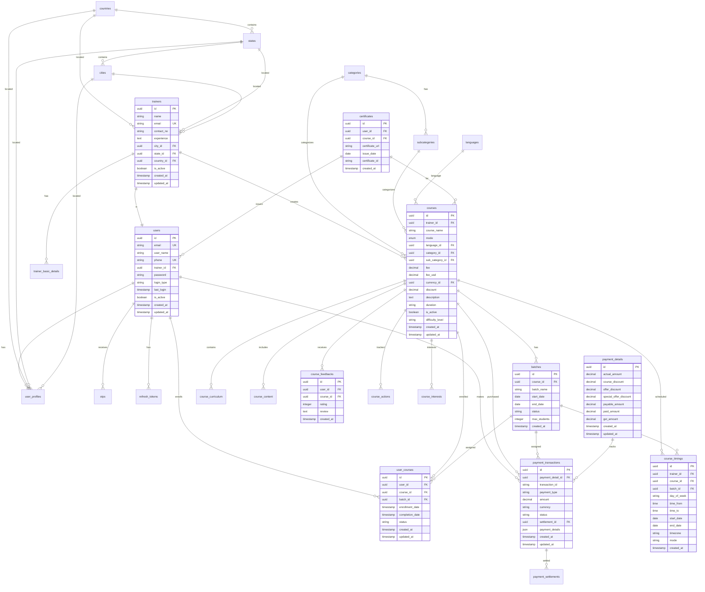
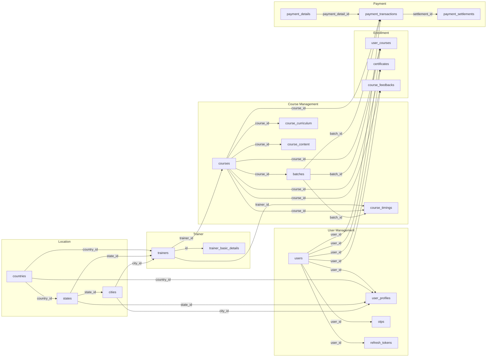
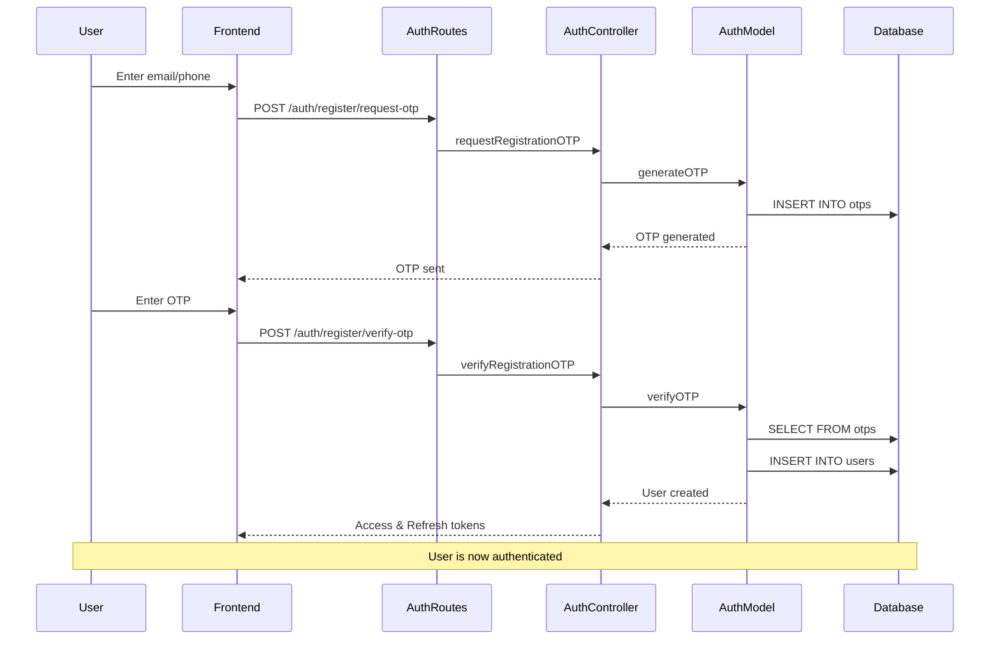
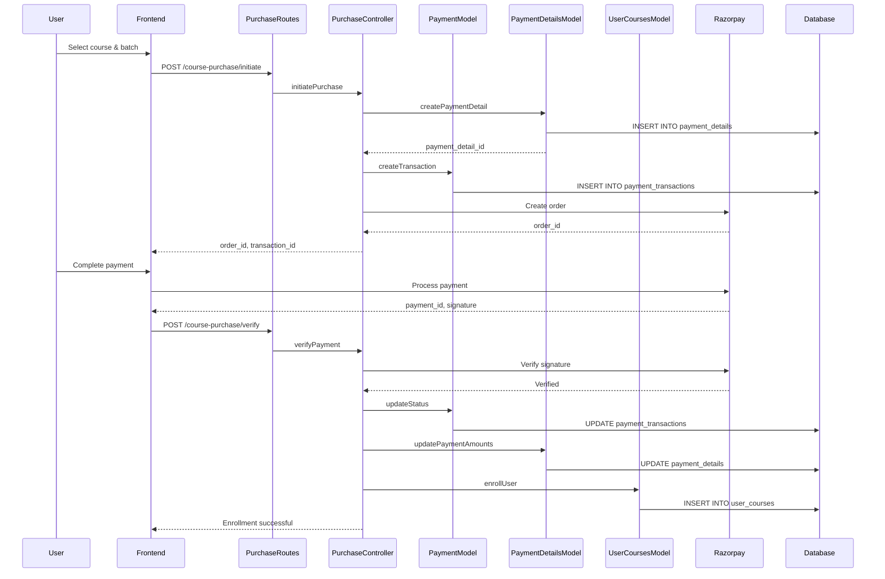
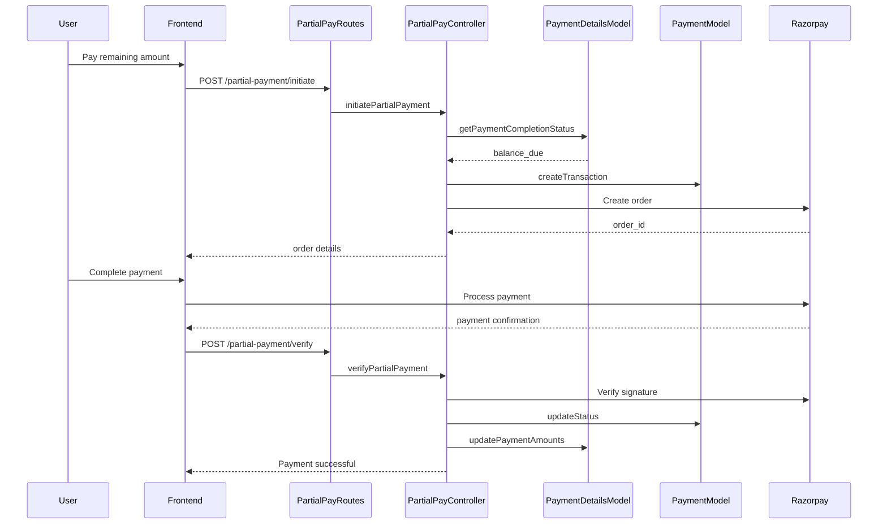

# Backend Learnees - Complete System Architecture 
 
> [!NOTE] 
> This document provides a comprehensive overview of the Backend_Learnees 
system architecture, including all routes, controllers, models, and their 
relationships. 
 
## Table of Contents 
1. [System Overview](#system-overview) 
2. [Complete Flow Diagram](#complete-flow-diagram) 
3. [Database Schema](#database-schema) 
4. [Route-Controller-Model Mappings](#route-controller-model-mappings) 
5. [Table Relationships](#table-relationships) 
6. [API Flow Examples](#api-flow-examples) 
 --- 
 
## System Overview 
 
The **Backend_Learnees** is a comprehensive learning management system 
(LMS) that manages: - **User Authentication** (OTP-based, Google OAuth) - **Course Management** (creation, enrollment, batches, timings) - **Trainer Management** (profiles, courses, settlements) - **Payment Processing** (Razorpay, PayPal, partial payments) - **Certificates** (course completion certificates) - **Feedback & Reviews** (course and trainer feedback) - **Content Management** (curriculum, course content, blogs) 
 
### Architecture Components - **42 Models** - Database schema and business logic - **39 Controllers** - Request handling and business operations - **40 Routes** - API endpoints and request routing 
 --- 
 
## Complete Flow Diagram 

```mermaid 
graph TB 
    subgraph "Client Layer" 
        Client[Frontend Application] 
    end 
 
    subgraph "API Gateway" 
        Routes[Express Routes] 
        Middleware[Auth Middleware] 
    end 
 
    subgraph "Controller Layer" 
        AuthCtrl[authController] 
        CourseCtrl[patronsRegistrationController] 
        PurchaseCtrl[coursePurchaseController] 
        PaymentCtrl[paymentController] 
        PartialPayCtrl[partialPaymentController] 
        DashboardCtrl[dashBoardController] 
        TimingCtrl[timingsController] 
        FeedbackCtrl[courseFeedbackController] 
        BlogCtrl[blogController] 
        CertCtrl[CertificateController] 
    end 
 
    subgraph "Model Layer" 
        AuthModel[authModel<br/>users, trainers, tokens, otps] 
        CourseModel[CourseDetailsDTO<br/>courses, batches] 
        UserCoursesModel[UserCoursesModel<br/>user_courses] 
        PaymentModel[PaymentTransaction<br/>payment_transactions] 
        PaymentDetailsModel[PaymentDetailsModel<br/>payment_details] 
        TimingModel[TimingModel<br/>course_timings] 
        CurriculumModel[CurriculumModel<br/>course_curriculum] 
        FeedbackModel[CourseFeedback<br/>course_feedbacks] 
        CertModel[CertificateModel<br/>certificates] 
    end 
 
    subgraph "Database Layer" 
        PostgreSQL[(PostgreSQL Database)] 
    end 
 
    subgraph "External Services" 
        Razorpay[Razorpay API] 
        PayPal[PayPal API] 
        Email[Email Service] 
    end 
 
    Client -->|HTTP Requests| Routes 
    Routes --> Middleware 
    Middleware --> AuthCtrl 
    Middleware --> CourseCtrl 
    Middleware --> PurchaseCtrl 
    Middleware --> PaymentCtrl 
    Middleware --> PartialPayCtrl 
    Middleware --> DashboardCtrl 
    Middleware --> TimingCtrl 
    Middleware --> FeedbackCtrl 
    Middleware --> BlogCtrl 
    Middleware --> CertCtrl 
 
    AuthCtrl --> AuthModel 
    CourseCtrl --> CourseModel 
    CourseCtrl --> TimingModel 
    PurchaseCtrl --> PaymentModel 
    PurchaseCtrl --> PaymentDetailsModel 
    PurchaseCtrl --> UserCoursesModel 
    PaymentCtrl --> PaymentModel 
    PartialPayCtrl --> PaymentModel 
    PartialPayCtrl --> PaymentDetailsModel 
    DashboardCtrl --> CourseModel 
    DashboardCtrl --> UserCoursesModel 
    TimingCtrl --> TimingModel 
    FeedbackCtrl --> FeedbackModel 
    BlogCtrl --> AuthModel 
    CertCtrl --> CertModel 
 
    AuthModel --> PostgreSQL 
    CourseModel --> PostgreSQL 
    UserCoursesModel --> PostgreSQL 
    PaymentModel --> PostgreSQL 
    PaymentDetailsModel --> PostgreSQL 
    TimingModel --> PostgreSQL 
    CurriculumModel --> PostgreSQL 
    FeedbackModel --> PostgreSQL 
    CertModel --> PostgreSQL 
 
    PaymentCtrl --> Razorpay 
    PaymentCtrl --> PayPal 
    AuthCtrl --> Email 
``` 
 

 --- 
 
## Database Schema 
 
### Core Tables and Their Relationships 
 

 --- 
 
## Route-Controller-Model Mappings 
 
### Authentication Routes (`/auth`) 
 
| Method | Endpoint | Controller | Model | Description | 
|--------|----------|------------|-------|-------------| 
| POST | `/register/request-otp` | `authController.requestRegistrationOTP` 
| `authModel` | Request OTP for registration | 
| POST | `/register/verify-otp` | `authController.verifyRegistrationOTP` | 
`authModel` | Verify OTP and create user | 
| POST | `/login/request-otp` | `authController.requestLoginOTP` | 
`authModel` | Request OTP for login | 
| POST | `/login/verify-otp` | `authController.verifyLoginOTP` | 
`authModel` | Verify OTP and login | 
| POST | `/google-login` | `authController.googleLogin` | `authModel` | 
Google OAuth login | 
| GET | `/user` | `authController.getUserDataById` | `authModel` | Get 
user by ID | 
| GET | `/user/by-email` | `authController.getUserByEmail` | `authModel` | 
Get user by email | 
| POST | `/logout` | `authController.logout` | `authModel` | Logout user | 
| POST | `/refresh-token` | `authController.refreshToken` | `authModel` | 
Refresh access token | 
| POST | `/admin-login` | `authController.adminLogin` | `authModel` | 
Admin authentication | 
| GET | `/users` | `authController.getAllUsers` | `authModel` | Get all 
users (paginated) | 
 
### Course Management Routes (`/patrons`) 
 
| Method | Endpoint | Controller | Model | Description | 
|--------|----------|------------|-------|-------------| 
| GET | `/GetBasicDetails/:id` | 
`patronsRegistrationController.getBasicDetails` | `BasicDetailsDTO` | Get 
trainer details | 
| PATCH | `/AddBasicDetails` | 
`patronsRegistrationController.updateTrainerDetails` | `BasicDetailsDTO` | 
Update trainer details | 
| GET | `/GetCourseDetailsByTrainerId/:id` | 
`patronsRegistrationController.getCourseDetailsByTrainerId` | 
`CourseDetailsDTO` | Get courses by trainer | 
| GET | `/GetCourseDetailsById/:id` | 
`patronsRegistrationController.getCourseDetailsById` | `CourseDetailsDTO`, 
`paymentConfiguration` | Get course details | 
| POST | `/AddCourseDetails` | 
`patronsRegistrationController.addCourseDetails` | `CourseDetailsDTO` | 
Create new course | 
| PATCH | `/UpdateCourseDetails/:id` | 
`patronsRegistrationController.updateCourseDetails` | `CourseDetailsDTO` | 
Update course details | 
| DELETE | `/DeleteCourseDetails/:id` | 
`patronsRegistrationController.deleteCourseDetails` | `CourseDetailsDTO` | 
Delete course | 
| GET | `/GetAllCourses` | `patronsRegistrationController.getAllCourses` | 
`CourseDetailsDTO` | Get all courses | 
| GET | `/GetCategories` | `patronsRegistrationController.getCategories` | 
`CategoryModel` | Get all categories | 
| GET | `/GetSubCategories` | 
`patronsRegistrationController.getSubCategories` | `CategoryModel` | Get 
all subcategories | 
| GET | `/GetLanguage` | `patronsRegistrationController.getLanguage` | - | 
Get all languages | 
 
### Course Purchase Routes (`/course-purchase`) 
 
| Method | Endpoint | Controller | Model | Description | 
|--------|----------|------------|-------|-------------| 
| POST | `/initiate` | `coursePurchaseController.initiatePurchase` | 
`PaymentTransaction`, `PaymentDetailsModel` | Initiate course purchase | 
| POST | `/verify` | `coursePurchaseController.verifyPayment` | 
`PaymentTransaction`, `UserCoursesModel` | Verify payment and enroll | 
| GET | `/purchased/:userId` | 
`coursePurchaseController.getPurchasedCourses` | `UserCoursesModel`, 
`PaymentDetailsModel` | Get user's purchased courses | 
| GET | `/users/:courseId` | `coursePurchaseController.getCourseUsers` | 
`UserCoursesModel` | Get course enrollments | 
| GET | `/batch/:batchId/students` | 
`coursePurchaseController.getEnrolledStudentsByBatch` | `UserCoursesModel` 
| Get batch enrollments | 
| PUT | `/update-batch/:transaction_id` | 
`coursePurchaseController.updateBatchId` | `PaymentTransaction`, 
`UserCoursesModel` | Update batch assignment | 
| GET | `/invoice/transaction/:transactionId` | 
`coursePurchaseController.getInvoiceByTransaction` | `PaymentTransaction` 
| Get invoice by transaction | 
 
### Payment Routes (`/payment`) 
 
| Method | Endpoint | Controller | Model | Description | 
|--------|----------|------------|-------|-------------| 
| POST | `/create-order` | `paymentController.createOrder` | 
`PaymentTransaction` | Create payment order | 
| POST | `/verify-payment` | `paymentController.verifyPayment` | 
`PaymentTransaction` | Verify payment | 
| GET | `/transaction/:id` | `transactionController.getTransaction` | 
`PaymentTransaction` | Get transaction details | 
 
### Partial Payment Routes (`/partial-payment`) 
 
| Method | Endpoint | Controller | Model | Description | 
|--------|----------|------------|-------|-------------| 
| POST | `/initiate` | `partialPaymentController.initiatePartialPayment` | 
`PaymentTransaction`, `PaymentDetailsModel` | Initiate partial payment | 
| POST | `/verify` | `partialPaymentController.verifyPartialPayment` | 
`PaymentTransaction`, `PaymentDetailsModel` | Verify partial payment | 
| GET | `/pending/:userId` | `partialPaymentController.getPendingPayments` 
| `PaymentDetailsModel` | Get pending payments | 
| GET | `/payment-details/:paymentDetailId` | 
`partialPaymentController.getPaymentDetails` | `PaymentDetailsModel` | Get 
payment details | 
 
### Timing Routes (`/timings`) 
 
| Method | Endpoint | Controller | Model | Description | 
|--------|----------|------------|-------|-------------| 
| POST | `/add` | `timingsController.addTiming` | `TimingModel` | Add 
course timing | 
| PUT | `/update/:id` | `timingsController.updateTiming` | `TimingModel` | 
Update timing | 
| GET | `/course/:courseId` | `timingsController.getByCourseId` | 
`TimingModel` | Get timings by course | 
| GET | `/trainer/:trainerId` | `timingsController.getByTrainerId` | 
`TimingModel` | Get timings by trainer | 
| DELETE | `/:id` | `timingsController.deleteTiming` | `TimingModel` | 
Delete timing | 
 
### Dashboard Routes (`/dashboard`) 
 
| Method | Endpoint | Controller | Model | Description | 
|--------|----------|------------|-------|-------------| 
| GET | `/stats/trainer/:trainerId` | 
`dashBoardController.getTrainerStats` | `CourseDetailsDTO`, 
`UserCoursesModel`, `PaymentTransaction` | Get trainer dashboard stats | 
| GET | `/stats/admin` | `dashBoardController.getAdminStats` | Multiple 
models | Get admin dashboard stats | 
| GET | `/recent-enrollments/:trainerId` | 
`dashBoardController.getRecentEnrollments` | `UserCoursesModel` | Get 
recent enrollments | 
 
### Certificate Routes (`/certificate`) 
 
| Method | Endpoint | Controller | Model | Description | 
|--------|----------|------------|-------|-------------| 
| POST | `/generate` | `CertificateController.generateCertificate` | 
`CertificateModel` | Generate certificate | 
| GET | `/:userId/:courseId` | `CertificateController.getCertificate` | 
`CertificateModel` | Get certificate | 
 
### Feedback Routes (`/course-feedback`) 
 
| Method | Endpoint | Controller | Model | Description | 
|--------|----------|------------|-------|-------------| 
| POST | `/add` | `courseFeedbackController.addFeedback` | 
`CourseFeedback` | Add course feedback | 
| GET | `/course/:courseId` | `courseFeedbackController.getCourseFeedback` 
| `CourseFeedback` | Get course feedbacks | 
 
### Blog Routes (`/blog`) 
 
| Method | Endpoint | Controller | Model | Description | 
|--------|----------|------------|-------|-------------| 
| POST | `/create` | `blogController.createBlog` | `blogModel` | Create 
blog post | 
| GET | `/all` | `blogController.getAllBlogs` | `blogModel` | Get all 
blogs | 
| GET | `/:id` | `blogController.getBlogById` | `blogModel` | Get blog by 
ID | 
 --- 
 
## Table Relationships 
 
### Primary Foreign Key Relationships 
 

 
### Key Foreign Key Constraints 
 
| Child Table | Foreign Key Column | Parent Table | Parent Column | 
Description | 
|-------------|-------------------|--------------|---------------|-------------| 
| `users` | `trainer_id` | `trainers` | `id` | Links user to trainer 
profile | 
| `trainer_basic_details` | `country_id`, `state_id`, `city_id` | 
`countries`, `states`, `cities` | `id` | Trainer location | 
| `courses` | `trainer_id` | `trainers` | `id` | Course creator | 
| `courses` | `category_id`, `sub_category_id` | `categories`, 
`subcategories` | `id` | Course categorization | 
| `courses` | `language_id` | `languages` | `id` | Course language | 
| `batches` | `course_id` | `courses` | `id` | Batch assignment | 
| `course_timings` | `trainer_id`, `course_id`, `batch_id` | `trainers`, 
`courses`, `batches` | `id` | Timing schedule | 
| `user_courses` | `user_id`, `course_id`, `batch_id` | `users`, 
`courses`, `batches` | `id` | Course enrollment | 
| `payment_transactions` | `payment_detail_id` | `payment_details` | `id` 
| Payment tracking | 
| `certificates` | `user_id`, `course_id` | `users`, `courses` | `id` | 
Certificate issuance | 
 --- 
 
## API Flow Examples 
 
### 1. User Registration and Course Purchase Flow 
 

 
### 2. Course Purchase and Enrollment Flow 
 

 
### 3. Partial Payment Flow 
 

 --- 
 
## Additional Route Groups 
 
### Admin Access Routes (`/admin-access`) 
Manage admin permissions, access pages, and special permissions. 
 
### Blog Routes (`/blog`) 
Create and manage blog content for the platform. 
 
### Category Routes (`/category`) 
Manage course categories and subcategories. 
 
### Corporate Training Routes (`/corporate-training`) 
Handle corporate training requests. 
 
### Course Curriculum Routes (`/course-curriculum`) 
Manage course curriculum structure. 
 
### Course Mapping Routes (`/course-mapping`) 
Map courses to various entities. 
 
### Notification Routes (`/notification`) 
Manage user notifications. 
 
### Payment Configuration Routes (`/payment-configuration`) 
Configure payment settings (registration fee, GST). 
 
### Payment Settlement Routes (`/payment-settlement`) 
Manage trainer payment settlements. 
 
### Support Type Routes (`/support-type`) 
Manage user support requests. 
 
### Trainer Support Routes (`/trainer-support`) 
Trainer-specific support system. 
 
### Training Info Routes (`/training-info`) 
Additional training information management. 
 --- 
 
## Summary Statistics 
 
### System Components 
 
| Component | Count | Description | 
|-----------|-------|-------------| 
| **Models** | 42 | Database models and business logic | 
| **Controllers** | 39 | Request handlers and operations | 
| **Routes** | 40 | API endpoint definitions | 
| **Core Tables** | 30+ | PostgreSQL database tables | 
 
### Key Database Tables 
 - **Authentication**: `users`, `trainers`, `otps`, `tokens`, 
`refresh_tokens` - **Courses**: `courses`, `batches`, `course_timings`, 
`course_curriculum`, `course_content` - **Enrollment**: `user_courses`, `certificates` - **Payments**: `payment_details`, `payment_transactions`, 
`payment_settlements` - **Location**: `countries`, `states`, `cities` - **Categorization**: `categories`, `subcategories`, `languages` - **Feedback**: `course_feedbacks`, `trainer_feedbacks` - **Content**: `blogs`, `course_actions`, `course_interests` 
 --- 
 
## Technology Stack 
 - **Backend Framework**: Express.js - **Database**: PostgreSQL with UUID primary keys - **Authentication**: JWT (Access & Refresh tokens), OTP-based auth - **Payment Gateways**: Razorpay, PayPal - **Documentation**: Swagger/OpenAPI - **ORM Pattern**: Raw SQL queries with connection pooling 
 --- 
 
> [!TIP] 
> For detailed API specifications, refer to the Swagger documentation at 
`/api-docs` endpoint when the server is running. 
 
> [!IMPORTANT] 
> All payment flows use a normalized schema where `payment_details` stores 
the financial breakdown, and `payment_transactions` tracks individual 
payment events. 
 
 
